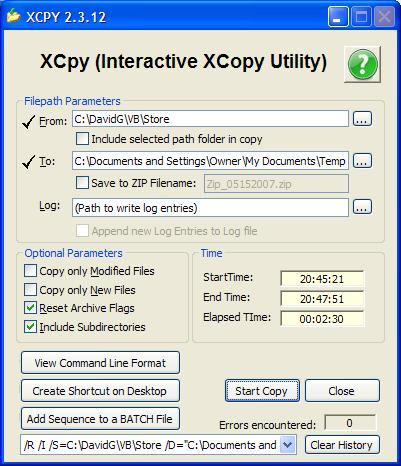



## Xcpy \- Versatile Interactive Xcopy Utility \(Version 2\.3\.14\)

### Description

Version 2.3.14. Made the icon display in the status bar much clearer. XCPY is a user-interface that emulates the Xcopy DOS command, allowing the user to copy or backup a file or group of files or folders interactively. The application works by copying all files from within a source path to within a destination path. Hence, specifying a source folder will copy all the contents from WITHIN that folder, but not the folder itself, to WITHIN an EXISTING destination path or folder. This is important in typical backup scenarios. However, if you do wish to actually backup an actual source folder, then simply append a backslash to the folder path (for example, C:\Program Files\Data Folder\), or you can check the &lt;Include Selected Path Folder in Copy&gt; checkbox. Options to copy only modified files, only new files, to reset the archive flags on the files copied, and an option to include subdirectories are included. Also featured is a command line reporter that will generate a command line sequence, which you can enter into a shortcut that you can use to repeat the selected operation (backing up certain folders is a often-repeated practice). Or, you can simply have XPY generate a Desktop shortcut for you to support the selections you have made. If you have several archiveal operations that you would like to save in a batch file to run all at once, XCPY has another option to generate such a batch file, or append to an existing batch file. The shortcut or batch file will in turn invoke XCPY and supply it with the options that you had selected. When executed from a shortcut or batch file, each instance of XCPY will exit when it has completed its operation (Batch files can run numerous copies of XCPY simutaneously, speeding even complex data copying requirement). I originally wrote this utility to back up valuable proprietary company source code, reports, and databases to an archive server. It has been in heavy use in numerous offices for the past 12 years since then, allowing its users to initiate complete or modification-only backups of their data with a simple click of a mouse button. This project also demonstrates using an imbedded XP-Style Manifest from a Resource file (*.res). It also features an option to Xcopy the data into a ZIP file. Version 2.3.13 corrected a last-minute enhancement in Version 2.3.12 that lost the history list if the utility was launched with command-line parameters. It also cleans up presentation of command line options. It also fixes log append flag confusion. Finally, it replaced the FSO.CopyFile option with the CopyFileA() API call for Win95/98/ME, and to CopyFileEX for NT/XP systems, allowing HUGE files to keep from appearing to freeze the system up, as the File System Object's CopyFile() method will do. The CopyFileEX() addition also demonstrates file progress callback invocation. Version 2.3.14 makes the icon display in the status bar much clearer.
 
### More Info
 

             |
---                |---
**Submitted On**   |2007-05-24 13:03:50
**By**             |[David Ross Goben](https://github.com/Planet-Source-Code/PSCIndex/blob/master/ByAuthor/david-ross-goben.md)
**Level**          |Advanced
**User Rating**    |5.0 (35 globes from 7 users)
**Compatibility**  |VB 6\.0
**Category**       |[Complete Applications](https://github.com/Planet-Source-Code/PSCIndex/blob/master/ByCategory/complete-applications__1-27.md)
**World**          |[Visual Basic](https://github.com/Planet-Source-Code/PSCIndex/blob/master/ByWorld/visual-basic.md)
**Archive File**   |[Xcpy\_\-\_Ver2067365252007\.zip](https://github.com/Planet-Source-Code/david-ross-goben-xcpy-versatile-interactive-xcopy-utility-version-2-3-14__1-68600/archive/master.zip)

